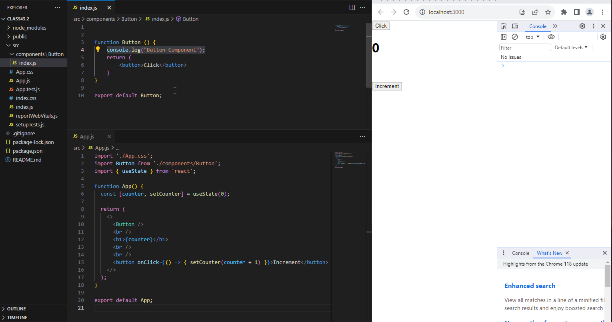

# ReactJS
React documentation

# React.memo
###### App.js
```
//--App.js--
import './App.css';
import Button from './components/Button';
import { useState } from 'react';

function App() {
  const [counter, setCounter] = useState(0);
  return (
    <>
      <Button />
      <br />
      <h1>{counter}</h1>
      <br />
      <br />
      <button onClick={() => { setCounter(counter + 1) }}>Increment</button>
    </>
  );
}
export default App;
```
###### componenets/Button/index.js
```
//--components/Button/index.js--

function Button () {
    console.log("Button Component");
    return (
        <button>Click</button>
    )
}
export default Button;
```
But, if we don't want to render the button component every time. So, we use the *React Hook* **React.memo**. It memorises the component and do not let them to be rendered, every time when state changes but, only once at first time render.
Here, look the variation in the code of Button component.
to use **React.memo**, we have to first import. So, added the line

`import React from "react";`

Then, we use React.memo exactly where we are exporting the component like this

`export default React.memo(Button)`

See the complete code with changes.
```
//--components/Button/index.js--
import React from "react";
function Button () {
    console.log("Button Component");
    return (
        <button>Click</button>
    )
}
export default React.memo("Button");
```

Here is the glimpse of the working code.

