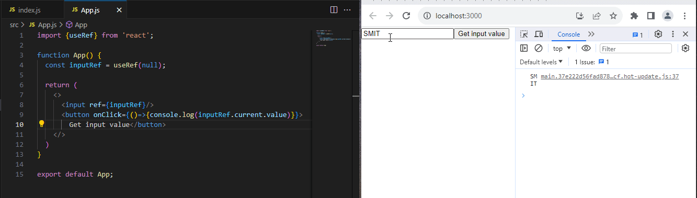
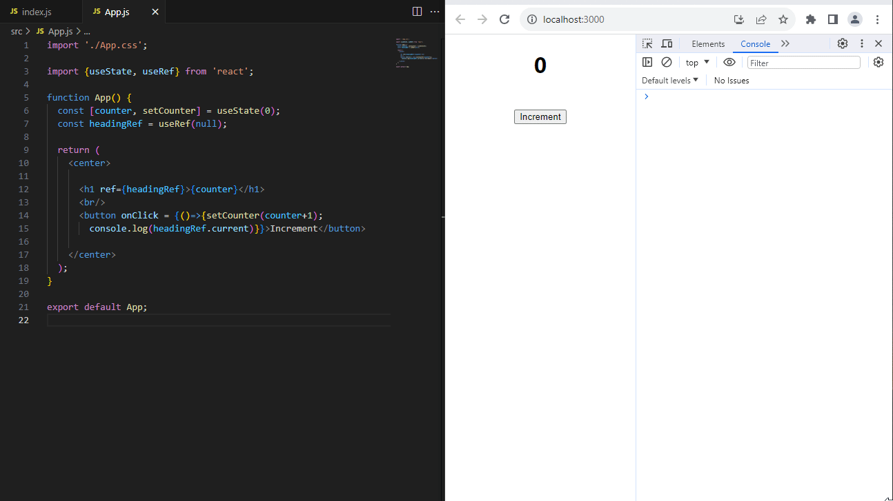
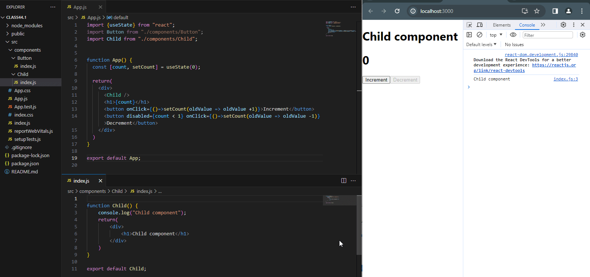
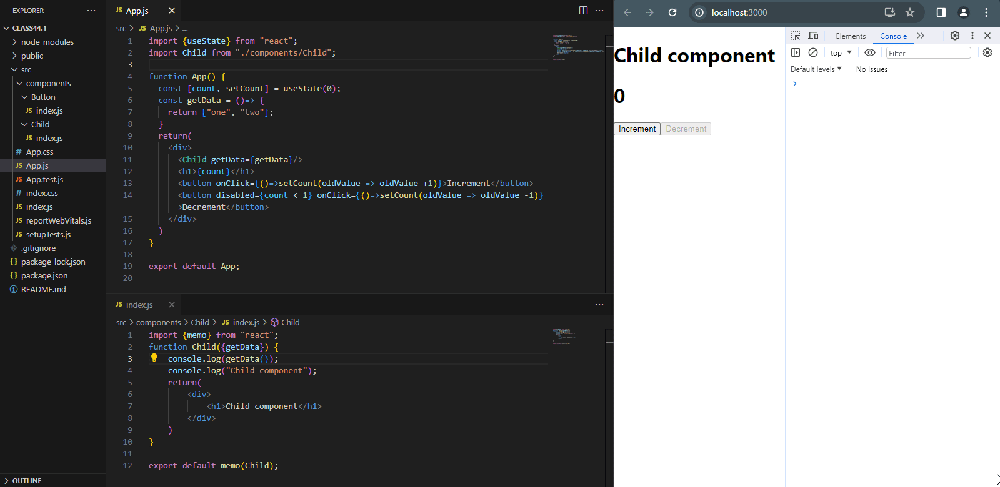

# ReactJS
React documentation

# React.memo
###### App.js
```
//--App.js--
import './App.css';
import Button from './components/Button';
import { useState } from 'react';

function App() {
  const [counter, setCounter] = useState(0);
  return (
    <>
      <Button />
      <br />
      <h1>{counter}</h1>
      <br />
      <br />
      <button onClick={() => { setCounter(counter + 1) }}>Increment</button>
    </>
  );
}
export default App;
```
###### componenets/Button/index.js
```
//--components/Button/index.js--

function Button () {
    console.log("Button Component");
    return (
        <button>Click</button>
    )
}
export default Button;
```
But, if we don't want to render the button component every time. So, we use the *React Hook* **React.memo**. It memorises the component and do not let them to be rendered, every time when state changes but, only once at first time render.
Here, look the variation in the code of Button component.
to use **React.memo**, we have to first import. So, added the line

`import React from "react";`

Then, we use React.memo exactly where we are exporting the component like this

`export default React.memo(Button)`

See the complete code with changes.
```
//--components/Button/index.js--
import React from "react";
function Button () {
    console.log("Button Component");
    return (
        <button>Click</button>
    )
}
export default React.memo("Button");
```

Here is the glimpse of the working code.


# useRef
### Example 1
using useRef hook get the value from input field.
###### App jsx
```
//--App.js--
import {useRef} from 'react';

function App() {
  const inputRef = useRef(null);

  return (
    <>
      <input ref={inputRef}/>
      <button onClick={()=>{console.log(inputRef.current.value)}}>Get input value</button>
    </>
  )
}

export default App;
```


### Example 2
using useRef hook get a DOM element.

The previous code for counter, in which on every click on "Increment" button, the counter increments by 1 because of changing state using **useState** React hook.
Here I am using **useRef** to get the DOM element.

```
//--App.js--
import './App.css';

import {useState, useRef} from 'react';

function App() {
  const [counter, setCounter] = useState(0);
  const headingRef = useRef(null);

  return (
    <>
      <h1 ref={headingRef}>{counter}</h1>
      <br/>
      <button onClick = {()=>{setCounter(counter+1); console.log(headingRef.current)}}>Increment</button>

    </>
  );
}

export default App;

```


# useCallback
You have seen the application of **React.memo** or simply **memo** that how it avoids unnecessary rendering by memorizing the rendered output. It improves the performance by memorizing the result and skip the last rendered result. Any component that put into **memo** method of **React** will not be re-rendered by with the re-rendering of main component of App because of **state change**. 
See below the example of **memo** usage again;

### Example 1: using memo avoid re-rendering
###### App.js
```
import {useState} from "react";
import Button from "./components/Button";
import Child from "./components/Child";


function App() {
  const [count, setCount] = useState(0);

  return(
    <div>
      <Child />
      <h1>{count}</h1>
      <button onClick={()=>setCount(oldValue => oldValue +1)}>Increment</button>
      <button disabled={count < 1} onClick={()=>setCount(oldValue => oldValue -1)}>Decrement</button>
    </div>
  )
}

export default App;
```
###### ./src/componenets/Button/index.js
```
import {memo} from "react";
function Child() {
    console.log("Child component");
    return(
        <div>
            <h1>Child component</h1>
        </div>
    )
}

export default memo(Child);
```


## BUT...
How long **memo** avoids the re-rendering of a component?
If a prop of a function or object is passed to the memorized component. Then it will **re-render** again with the re-rendering of the main component.

consider this code and its demo.
###### App.js
```
import {useState} from "react";
import Child from "./components/Child";

function App() {
  const [count, setCount] = useState(0);
  const getData = ()=> {
    return ["one", "two"];
  }
  return(
    <div>
      <Child getData={getData}/>
      <h1>{count}</h1>
      <button onClick={()=>setCount(oldValue => oldValue +1)}>Increment</button>
      <button disabled={count < 1} onClick={()=>setCount(oldValue => oldValue -1)}>Decrement</button>
    </div>
  )
}

export default App;
```
###### ./src/components/Child/index.js
```
import {memo} from "react";
function Child({getData}) {
    console.log(getData());
    console.log("Child component");
    return(
        <div>
            <h1>Child component</h1>
        </div>
    )
}
export default memo(Child);
```

